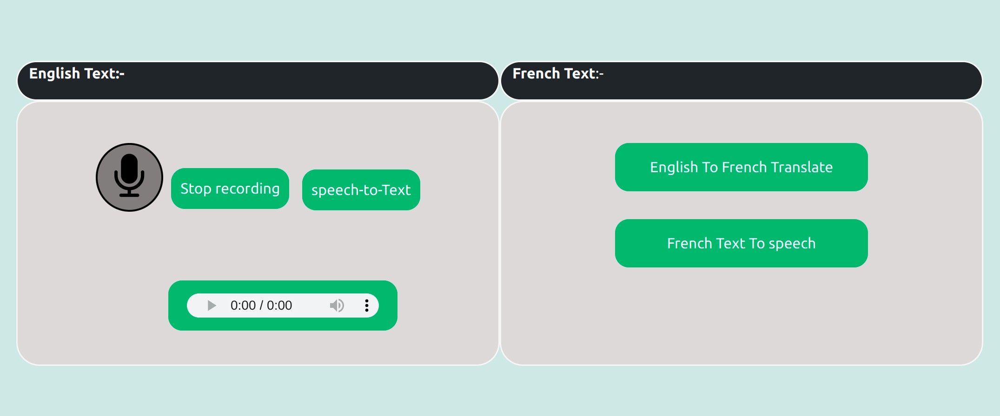
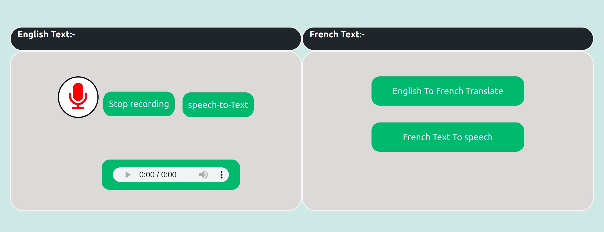
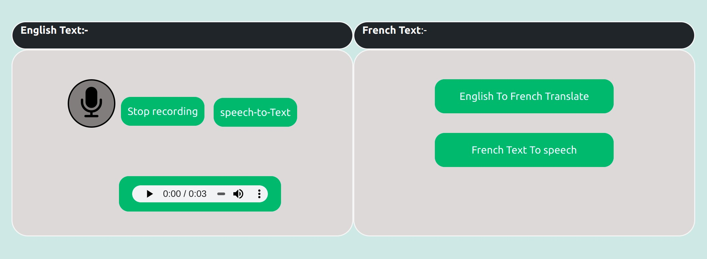
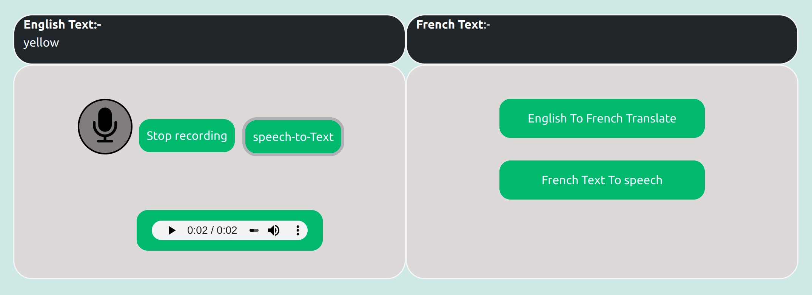
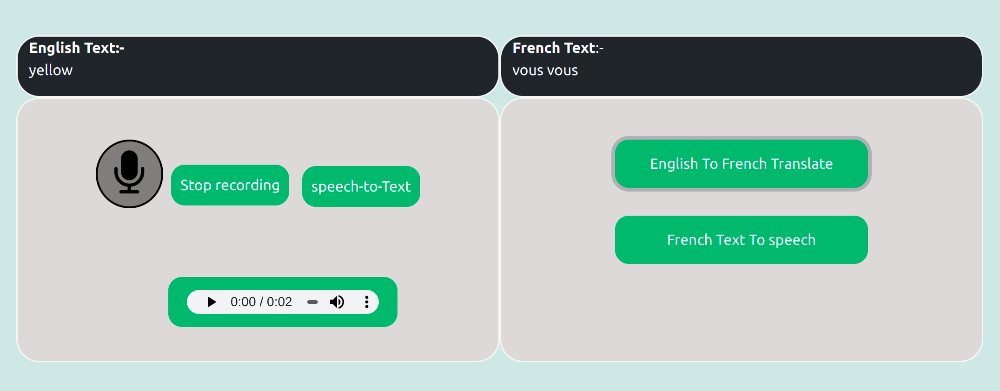

# Speech to Speech Translator

This application converts English speech to French speech. Users can record their voice in English and can convert it to text. The model(trained using a neural network to translate English text to French text, will discuss model training later) on the back-end only accepts text. To translate English speech to French speech we need to convert speech to text(I used google speech API in the backend to convert speech to text) and then converted text will be fed to the trained model to translate english to french. Once we have converted english speech to english text we can feed english text to the trained model and the model will return french text.Translated french text will be sent on the front end. We will get text(French) on the front-end after translation, but as we discussed This application translates English speech to French speech so we will convert translated text(French) to speech. I have used google speech API on the backend to convert text to speech. French Speech converted from the French-text can be played on the front end.

#### This is front-end where user can record their voice ,and translate english to french

#### when user will click on record button ,it will start voice recording as you can see in image

#### you can stop recording on click stop button,once you click on stop, recorded audio will be be ready to play in play button as you can see
 

#### Now we have recorded audio,we need to translate this recorded audio to french audio ,to translate english to french audio you have to convert reocded voice to text,when speech to text button will be clicked ,recorded voice will be converted into text,and text will be display as you can seed recorded voice was yellow

#### now when english to french button will be cliked to translate english text to french text.after that french to speech button will be clicked to convert french text to french speech,and it will play french audio once cliked on french to speech button

### Install conda
  #### step1
  #### download the Miniconda installer for Linux:- 
  https://repo.anaconda.com/miniconda/Miniconda3-py39_4.12.0-Windows-x86_64.exe

  #### step2
  #### run downloaded file
  bash Miniconda3-latest-Linux-x86_64.sh
  
  Press Enter to review the license agreement. Then press and hold Enter to scroll
  
  Enter “yes” to agree to the license agreement.

### Create conda environment 
conda create -n myenv python=3.9

### install requirements.txt file
pip install -r requirements.txt
     
## 3 get data set using following link

## Install google cloud sdk

To install google cloud run follwoing command in terminal

#### Step 1
Install some dependencies
sudo apt-get install apt-transport-https ca-certificates gnupg
 
 
#### step 2  
Add the gcloud CLI distribution URI as a package source. If your distribution supports the signed-by option, run the following command:
echo "deb [signed-by=/usr/share/keyrings/cloud.google.gpg] https://packages.cloud.google.com/apt cloud-sdk main" | sudo tee -a /etc/apt/sources.list.d/google-cloud-sdk.list
 
#### Step 3
Import the Google Cloud public key. If your distribution's apt-key command supports the --keyring argument, run the following command:
curl https://packages.cloud.google.com/apt/doc/apt-key.gpg | sudo apt-key --keyring /usr/share/keyrings/cloud.google.gpg add -
 
#### Step3 
Update and install the gcloud CLI
sudo apt-get update && sudo apt-get install google-cloud-cli

 
