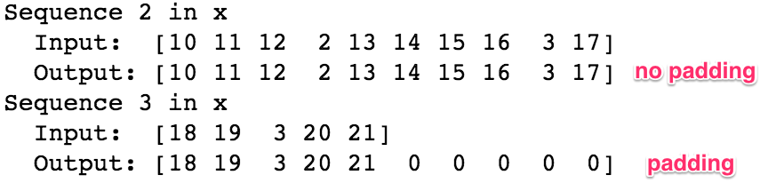
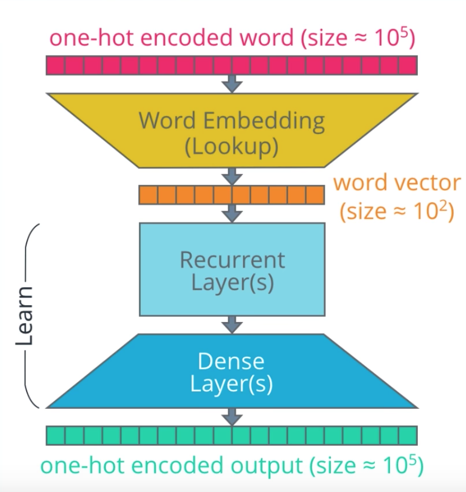
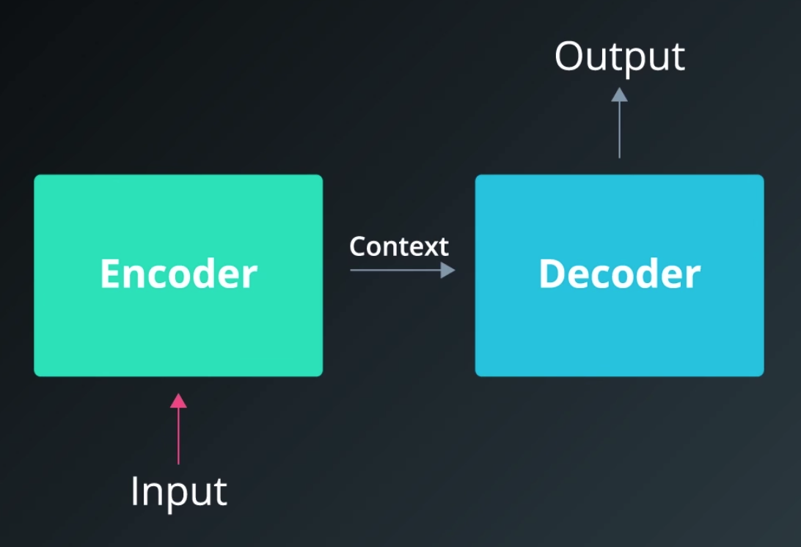
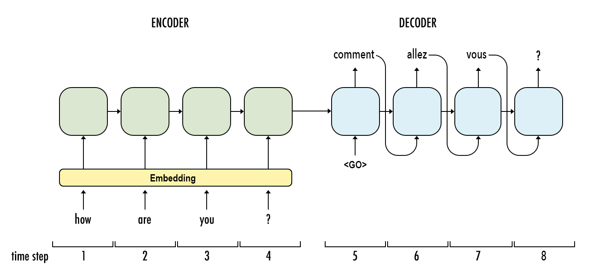
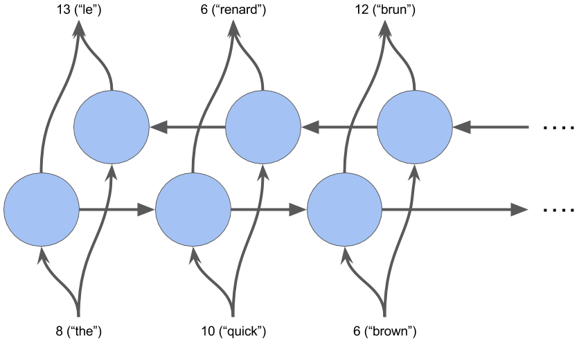
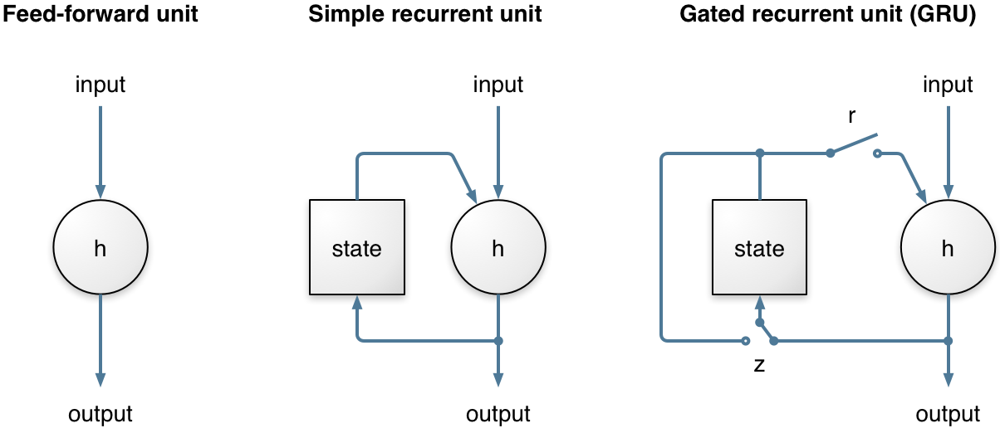

# Machine Translation with RNNs

##### &nbsp;

##### &nbsp;

## Goal
In this project, i build a deep neural network that functions as part of a machine translation pipeline. The pipeline accepts English text as input and returns the French translation. The goal is to achieve the highest translation accuracy possible.

##### &nbsp;

## Approach
To translate a corpus of English text to French, build a recurrent neural network (RNN).

### Building the Pipeline
Below is a summary of the various preprocessing and modeling steps. The high-level steps include:

1. **Preprocessing**: load and examine data, cleaning, tokenization, padding
1. **Modeling**: build, train, and test the model
1. **Prediction**: generate specific translations of English to French, and compare the output translations to the ground truth translations
1. **Iteration**: iterate on the model, experimenting with different architectures

### Toolset
i use Keras for the frontend and TensorFlow for the backend in this project. I

##### &nbsp;

## Preprocessing

### Load & Examine Data
Here is a sample of the data. The inputs are sentences in English; the outputs are the corresponding translations in French.

> 

##### &nbsp;

When we run a word count, we can see that the vocabulary for the dataset is quite small. This was by design for this project. This allows us to train the models in a reasonable time.

> 

### Cleaning
No additional cleaning needs to be done at this point. The data has already been converted to lowercase and split so that there are spaces between all words and punctuation.

_Note:_ For other NLP projects you may need to perform additional steps such as: remove HTML tags, remove stop words, remove punctuation or convert to tag representations, label the parts of speech, or perform entity extraction.  

### Tokenization
Next we need to tokenize the data&mdash;i.e., convert the text to numerical values. This allows the neural network to perform operations on the input data. For this project, each word and punctuation mark will be given a unique ID. (For other NLP projects, it might make sense to assign each character a unique ID.)

When we run the tokenizer, it creates a word index, which is then used to convert each sentence to a vector.

> 

### Padding
When we feed our sequences of word IDs into the model, each sequence needs to be the same length. To achieve this, padding is added to any sequence that is shorter than the max length (i.e. shorter than the longest sentence).

> 

### One-Hot Encoding (not used)
In this project,  input sequences will be a vector containing a series of integers. Each integer represents an English word (as seen above).

##### &nbsp;

## Modeling
First, let's breakdown the architecture of a RNN at a high level. Referring to the diagram above, there are a few parts of the model we to be aware of:

1. **Inputs** &mdash; Input sequences are fed into the model with one word for every time step. Each word is encoded as a unique integer or one-hot encoded vector that maps to the English dataset vocabulary.
1. **Embedding Layers** &mdash; Embeddings are used to convert each word to a vector. The size of the vector depends on the complexity of the vocabulary.
1. **Recurrent Layers (Encoder)** &mdash; This is where the context from word vectors in previous time steps is applied to the current word vector.
1. **Dense Layers (Decoder)** &mdash; These are typical fully connected layers used to decode the encoded input into the correct translation sequence.
1. **Outputs** &mdash; The outputs are returned as a sequence of integers or one-hot encoded vectors which can then be mapped to the French dataset vocabulary.

##### &nbsp;

### Embeddings
Embeddings allow us to capture more precise syntactic and semantic word relationships. This is achieved by projecting each word into n-dimensional space. Words with similar meanings occupy similar regions of this space; the closer two words are, the more similar they are. And often the vectors between words represent useful relationships, such as gender, verb tense, or even geopolitical relationships.

Training embeddings on a large dataset from scratch requires a huge amount of data and computation. So, instead of doing it ourselves, we'd normally use a pre-trained embeddings package such as [GloVe](https://nlp.stanford.edu/projects/glove/) or [word2vec](https://mubaris.com/2017/12/14/word2vec/). When used this way, embeddings are a form of transfer learning. However, since our dataset for this project has a small vocabulary and little syntactic variation, we'll use Keras to train the embeddings ourselves.

##### &nbsp;

### Encoder & Decoder
Our sequence-to-sequence model links two recurrent networks: an encoder and decoder. The encoder summarizes the input into a context variable, also called the state. This context is then decoded and the output sequence is generated.

##### &nbsp;

##### &nbsp;

Since both the encoder and decoder are recurrent, they have loops which process each part of the sequence at different time steps. 

In the example below, it takes four time steps to encode the entire input sequence. At each time step, the encoder "reads" the input word and performs a transformation on its hidden state. Then it passes that hidden state to the next time step.  hidden state represents the relevant context flowing through the network. The bigger the hidden state, the greater the learning capacity of the model, but also the greater the computation requirements. 

##### &nbsp;

For now, notice that for each time step after the first word in the sequence there are two inputs: the hidden state and a word from the sequence. For the encoder, it's the _next_ word in the input sequence. For the decoder, it's the _previous_ word from the output sequence.

Also, remember that when we refer to a "word," we really mean the _vector representation_ of the word which comes from the embedding layer.

##### &nbsp;

### Bidirectional Layer

To implement this, i train two RNN layers simultaneously. The first layer is fed the input sequence as-is and the second is fed a reversed copy.

##### &nbsp;

### Hidden Layer &mdash; Gated Recurrent Unit (GRU)
makde our RNN a little bit smarter. Instead of allowing _all_ of the information from the hidden state to flow through the network, what if we could be more selective? Perhaps some of the information is more relevant, while other information should be discarded. This is essentially what a gated recurrent unit (GRU) does.

There are two gates in a GRU: an update gate and reset gate. To summarize, the **update gate (z)** helps the model determine how much information from previous time steps needs to be passed along to the future. Meanwhile, the **reset gate (r)** decides how much of the past information to forget.

##### &nbsp;

##### &nbsp;

## Results
The results from the final model can be found in cell 20 of the .

Validation accuracy: 97.5%

Training time: 23 epochs

Speech to Speech Translator

This application converts English speech to French speech. Users can record their voice in English and can convert it to text. The model(trained using a neural network to translate English text to French text, will discuss model training later) on the back-end only accepts text. To translate English speech to French speech we need to convert speech to text(I used google speech API in the backend to convert speech to text) and then converted text will be fed to the trained model to translate english to french. Once we have converted english speech to english text we can feed english text to the trained model and the model will return french text.Translated french text will be sent on the front end. We will get text(French) on the front-end after translation, but as we discussed This application translates English speech to French speech so we will convert translated text(French) to speech. I have used google speech API on the backend to convert text to speech. French Speech converted from the French-text can be played on the front end.

Elements

Back-End

Flask API: Flask is a web application framework written in Python. I used flask API to link the front-end with the back-end. The front end can send requests to the back-end to translate English text to French text, speech to text, and text to speech conversion. Javascript can not call python functions directly. I have used the Flask API To call python functions from the front end .

I have created three routes on the back-end in Flask API: text-to-speech,speech-to-text, and translation

Speech to text: as we discussed earlier users can record audio from the front-end. To translate recorded speech we need to convert speech to text. This route converts speech to text.From the front-end a speech will be passed to the Speech-to-text route using XMLHttpRequest to convert speech to text. Speech-to-text route uses google speech API to convert speech to text. This route responds with converted text on the front end. I have used HTML to display converted text. 

English to French: after voice recording we will have speech, speech will be converted into text as we have discussed above.After a speech to text conversion we need to translate this English-text to French- text. To translate English text to French text we need to hit Flask API to translate English to French.Model is trained on the backend using python(neural network). The English-to-french route will get an English sentence in the text form, then the route will feed this English sentence to the trained model. The model will return a translated french sentence,this french sentence will be passed to the front-end from the English-to-french route.

Text to speech: from the above English-to-French API we will get    French text on the front-end, as we have discussed this application is speech-to-speech translation so we need to convert this French text to French speech. To convert Text to speech this route uses Google speech API. The text-to-speech route will get a request from the front end with a sentence, then the sentence will be passed to the google speech API to convert the French text to speech.This route responds French speech on the front end to play.

Front-End
HTML, CSS, and JavaScript is used to design front end.As we have discussed, front end needs to talk with the backend for text to text translation,speech to text and text to speech conversion.Google Speech API is added on the back end to convert speech to text and text to speech.To hit backend API JavaScript needs to send a request to the back-end. To send requests from the front-end to the back- end, API like text-to-text, translation, text-to-speech, and speech-to-text on the backend we also need API on the front end. In this project, XMLHttpRequest API is used in JavaScript 

Record speech
     
There is a recording symbol that is used to record the voice of the user. Users can click on the recording button and it will start recording the voice. Recording functionality is implemented in javascript. The user can stop recording using the stop button, and once the recording is finished it can be played on the front-end 

Speech to text

As we have discussed to translate speech to speech we need to convert speech to text because back end model only accept sentence in text format to translate, On front-end, there is Speech to text button when Speech to text button will be clicked javaScript route will send a request to the back end to convert speech to text and route will get a sentence in text form and sentence will be displayed on the front end that what was the spoken sentence

Translate

Now we have spoken sentence in text format from the above speech-to-text route, now this text can be sent to the back-end to translate. On the front end there is a translate button, when user will click on this button route will take sentence(text) from front end and will hit back end English-to-French API, JavaScript “Translate” API will get translated french sentence in text format and it will be displayed on the front-end 

Text to speech

Now we have converted English-text to french-text,as we have seen in the  above route we will get a french sentence in text form now we need to convert this french text to french speech. To convert french text to french speech there is a button on the front end “text-to-speech”, when user will click on this button JavaScript API will hit Flask API(text-to-speech) on the back-end,JavaScript API will get a speech in response from back-end API, now this french speech can be played on the front-end.

Stop recording
There is a button on the front end to stop recording. The user will decide the duration of the audio recording. once the user clicks on the stop button recording will be stop and  audio automatically will be played on the front end

Play
Users can play recorded audio on the front-end.When “play” button will be clicked the recorded audio will be played on the front-end. There is another play button that is used to play translated audio.

Model Training
As we have discussed, to translate English text to French text we need to send a text from the front end to the back end.I have trained a neural network model to translate English text to French text.In this section steps for model training will be discussed

Dataset:
To train the neural network we need a data-set with English sentences and French sentences. The data set is taken from the GitHub website uploaded by tommytracey. The data set contains the input sentences in English and corresponding output sentences in French. There are 277 unique English words. 1961295 French words and 355 unique words in French.Number of unique words and sentences with maximum length these elements will be needed during the training and prediction time.

Tokenization: machine can not understand the text so we need to convert the text to a number This allows the neural network to perform operations on the input data When we run the tokenizer, the tokenizer map each unique word to an id, which is then used to convert each sentence to a vector

padding: When we feed our sequences (vector of id) into the model, each sequence(vector) needs to be the same length. To achieve this, padding is added to any sequence that is shorter than the max length

Modeling:
During modeling, these layers were added to the neural network

Inputs. Input sequences are fed into the model with one word for every time step

Embedding Layers. Embeddings are used to convert each word to a vector

Recurrent Layers (Encoder). This is where the context from word vectors in previous time steps is applied to the current word vector

Dense Layers (Decoder). These are fully connected layers used to decode the encoded input into the correct translation sequence.

Activation function relu is used 
Outputs. The outputs are returned as a sequence of integers(vector of integer) which can then be mapped to the French dataset vocabulary
Activation Function: Relu activation function is used in the hidden layer and the softmax activation function is used in the output layer
Accuracy: Accuracy metrics is used to calculate the performance of the model 
 
